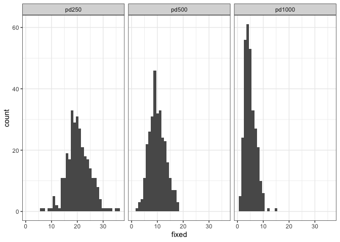

Validation of drift
================
Almorò Scarpa

## Introduction

This validation was inspired by the work of [Le Rouzic and
Capy](http://www.genetics.org/content/169/2/1033).

To test if drift is simulated correctly we exploit a basic population
genetic insight: the probability of fixation of a neutral singleton in a
diploid organism is:

=\frac{1}{2Ne}")

For different population sizes we thus expect the following number of
fixed loci:

-   for N=250 we expect 20 fixed loci
    

-   for N=500 we expect 10 fixed loci
    

-   for N=1000 we expect 5 fixed loci
    

To test if our simulations reproduce this fundamental property we
randomly distributed 10.000 neutral TE insertions that do NOT transpose
in a population. Each TE insertion had a starting frequency of 1/2N. We
followed these loci for 20.000 generations and recorded the number of
fixed insertions at the end. 100 replicates were used for each
population size.

### Initial conditions:

5 chromosomes of size 10 Mb, 5 piRNA clusters of size 1 Mb and an
initial number of TEs in the population equal to 10000.

We used 300 replicates for each simulation.

## Materials & Methods

version: invadego0.2.1

-   seed pd250: 1659361504473361000

-   seed pd500: 1659361504473374000

-   seed pd1000: 1659361504473280000

### Commands for the simulation:

``` bash
folder="/Users/ascarpa/Downloads/invadego_simulations/Paramutagenic_chain_reaction/Validation"
tool="/Users/ascarpa/invade-invadego/invadego021"

$tool --N 250 --gen 20000 --genome mb:10,10,10,10,10 --cluster mb:1,1,1,1,1 --rr 4,4,4,4,4 --rep 300 --u 0.0 --basepop 10000 --steps 10000 --sampleid pd250> $folder/validation_2_1 &       
$tool --N 500 --gen 20000 --genome mb:10,10,10,10,10 --cluster mb:1,1,1,1,1 --rr 4,4,4,4,4 --rep 300 --u 0.0 --basepop 10000 --steps 10000 --sampleid pd500> $folder/validation_2_2 &  
$tool --N 1000 --gen 20000 --genome mb:10,10,10,10,10 --cluster mb:1,1,1,1,1 --rr 4,4,4,4,4 --rep 300 --u 0.0 --basepop 10000 --steps 10000 --sampleid pd1000> $folder/validation_2_3

cat validation_2_1 validation_2_2 validation_2_3|awk '$2==20000' > 2022_08_01_Validation_2_Drift
```

### Visualization in R

Setting the environment

``` r
library(ggplot2)
library(RColorBrewer)
library(plyr)
library(gridExtra)
theme_set(theme_bw())
```

Visualization: comparing the simulations with the prediction

``` r
validation<-read.table("2022_08_01_Validation_2_Drift", fill = TRUE, sep = "\t")
names(validation)<-c("rep", "gen", "popstat", "fmale", "spacer_1", "fwte", "avw", "avtes", "avpopfreq", "fixed","spacer_2","phase","fwpirna","spacer_3","fwcli","avcli","fixcli","spacer_4","fwpar_yespi","fwpar_nopi","avpar","fixpar","spacer_5","piori","orifreq","spacer 6", "sampleid")
data_new <- validation
data_new$sampleid <- factor(data_new$sampleid,
                            levels = c("pd250", "pd500", "pd1000"))

gl<-ggplot(data=data_new,aes(x=fixed))+geom_histogram(binwidth = 1)+facet_grid(~sampleid)
plot(gl)
```

<!-- -->

## Conclusions

The simulation matched the expectations.

The simulator correctly reproduces genetic drift.
