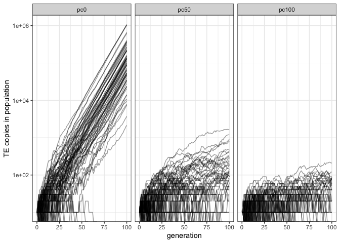

Validation piRNA clusters
================
Almorò Scarpa

## Introduction

### Scenarios

-   pc0: no piRNA clusters

-   pc50: 50% of the genome is composed by piRNA clusters

-   pc100: 100% of the genome is composed by piRNA clusters

### Starting conditions equal for all the simulations


A chromosome of size 1Mb and no piRNA clusters. 500 replicates.

### Commands for the simulation:

``` bash
folder="/Users/ascarpa/Downloads/invadego_simulations/Paramutagenic_chain_reaction/Validation"
tool="/Users/ascarpa/invade-invadego/invadego021"

$tool --N 1000 --gen 100 --genome mb:1 --cluster kb:0 --rr 4 --rep 100 --u 0.1 --basepop 10 --steps 1 --sampleid pc0> $folder/validation_3_1_clusters &
$tool --N 1000 --gen 100 --genome mb:1 --cluster kb:500 --rr 4 --rep 100 --u 0.1 --basepop 10 --steps 1 --sampleid pc50> $folder/validation_3_2 &
$tool --N 1000 --gen 100 --genome mb:1 --cluster kb:1000 --rr 4 --rep 100 --u 0.1 --basepop 10 --steps 1 --sampleid pc100> $folder/validation_3_3

cat validation_3_1 validation_3_2 validation_3_3 |grep -v "^Invade"|grep -v "^#" > 2022_08_01_Validation_3_piRNA_clusters
```

### Visualization in R

Setting the environment

``` r
library(ggplot2)
library(RColorBrewer)
library(plyr)
library(gridExtra)
theme_set(theme_bw())
```

Visualization: comparing the simulations with the prediction

``` r
validation<-read.table("2022_08_01_Validation_3_piRNA_clusters", fill = TRUE, sep = "\t")
names(validation)<-c("rep", "gen", "popstat", "fmale", "spacer_1", "fwte", "avw", "avtes", "avpopfreq", "fixed","spacer_2","phase","fwpirna","spacer_3","fwcli","avcli","fixcli","spacer_4","fwpar_yespi","fwpar_nopi","avpar","fixpar","spacer_5","piori","orifreq","spacer 6", "sampleid")
data_new <- validation
data_new$sampleid <- factor(data_new$sampleid,
                         levels = c("pc0", "pc50", "pc100"))

gl<-ggplot()+geom_line(data=data_new,aes(x=gen,group=rep,y=avtes*1000),alpha=0.4)+scale_y_log10()+theme(legend.position="none")+ylab("TE copies in population")+xlab("generation")+facet_grid(.~sampleid)
plot(gl)
```

<!-- -->

## Conclusions

The simulation matched the expectations.

The introduction of piRNA clusters stops the spreading of TEs in the
population.
